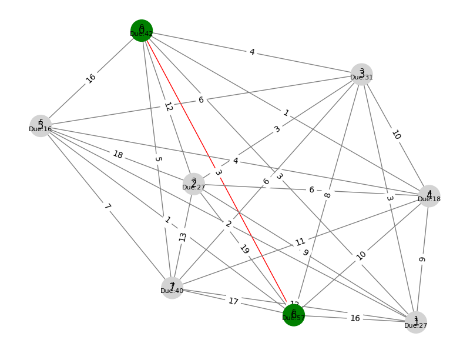

# 🚚 Merchant Delivery Simulation on Google Map

A web-based simulation that visualizes a merchant's delivery route using graph traversal. Built using **Flask** for the backend, **NetworkX** for graph logic, **Matplotlib** for visual representation, and **HTML/CSS/JS** for the frontend UI.

### 🌐 Live Demo

🔗 [Visit the Deployed App](https://map-2-na68.onrender.com/)

---

## 📌 Features

- Generates a **fully connected graph** of 8 nodes.
- Assigns **random edge weights** and **node due times**.
- User inputs:
  - **Start Node** (0–7)
  - **Start Time**
- Calculates a delivery path using **greedy traversal** that respects node due times.
- Outputs:
  - **Traversal path**
  - **Total time taken**
  - **Start and End node**
- Visual graph with:
  - Traversal path in **red**
  - Non-traversed paths in **low opacity gray**
  - Node due times shown on the graph

---

## 🖼️ Screenshot

> 

*(Note: This image is regenerated during every simulation)*

---

## 🛠️ Technologies Used

- **Backend**: Python, Flask
- **Graph Logic**: NetworkX
- **Visualization**: Matplotlib
- **Frontend**: HTML, CSS, Vanilla JS
- **Deployment**: Render.com

---

## 🚀 How It Works

1. **User Input**: Enter a start node and start time.
2. **Graph Generation**: Backend creates a fully connected graph with random weights and due times.
3. **Traversal Simulation**: A greedy path is computed from the start node to visit as many nodes as possible before their due time.
4. **Graph Image**: A visual representation is created and saved as `static/graph.png`.
5. **Frontend Update**: The image and path summary are shown on the webpage.

---

## 🧪 Local Setup Instructions

```bash
# Clone the repository
git clone https://github.com/yourusername/map-traversal-simulation.git
cd map-traversal-simulation

# Create a virtual environment
python -m venv venv
source venv/bin/activate   # On Windows: venv\Scripts\activate

# Install dependencies
pip install -r requirements.txt

# Run the app
python app.py


📦 project-root
├── app.py                  # Flask backend
├── templates/
│   └── index.html          # Frontend HTML page
├── static/
│   └── graph.png           # Output graph image
├── requirements.txt        # Python dependencies
└── README.md               # Project documentation
